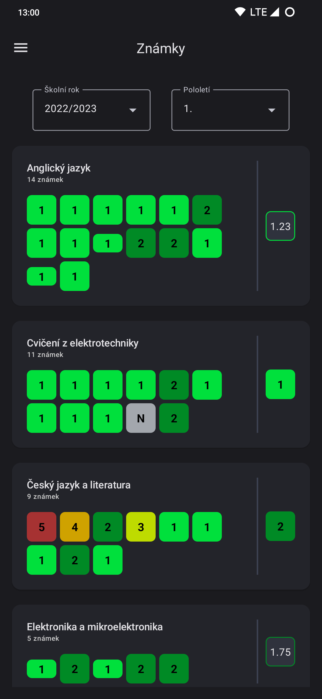
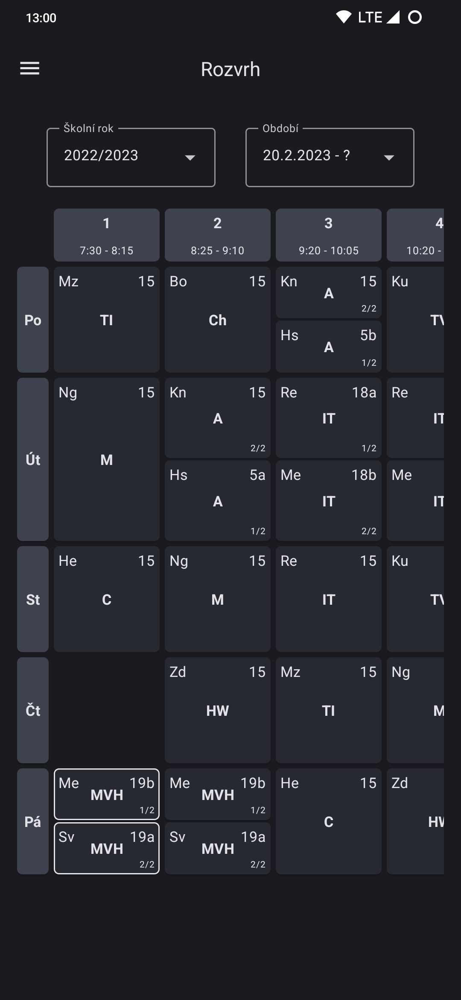
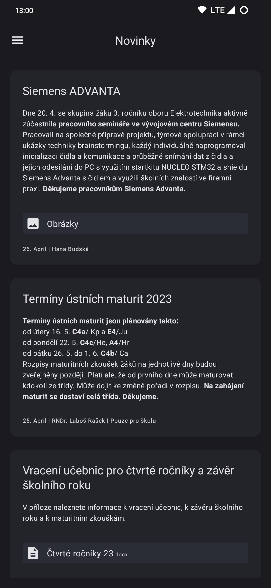
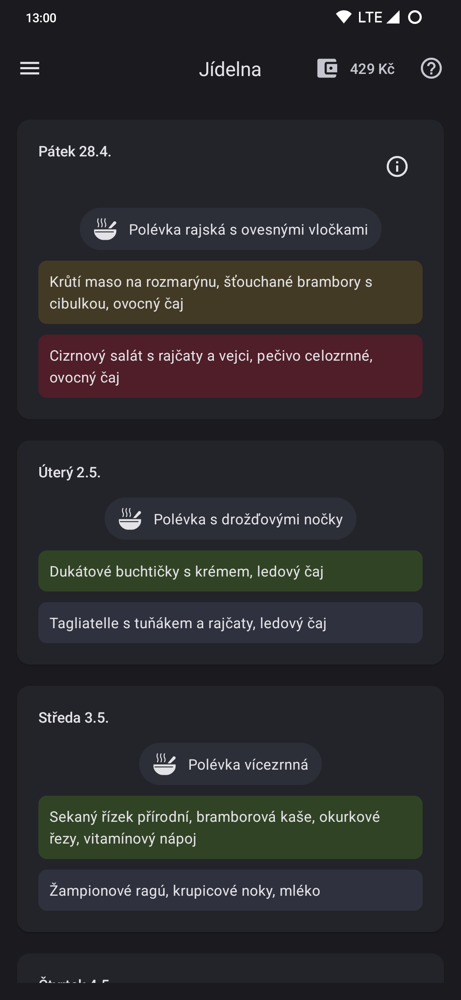
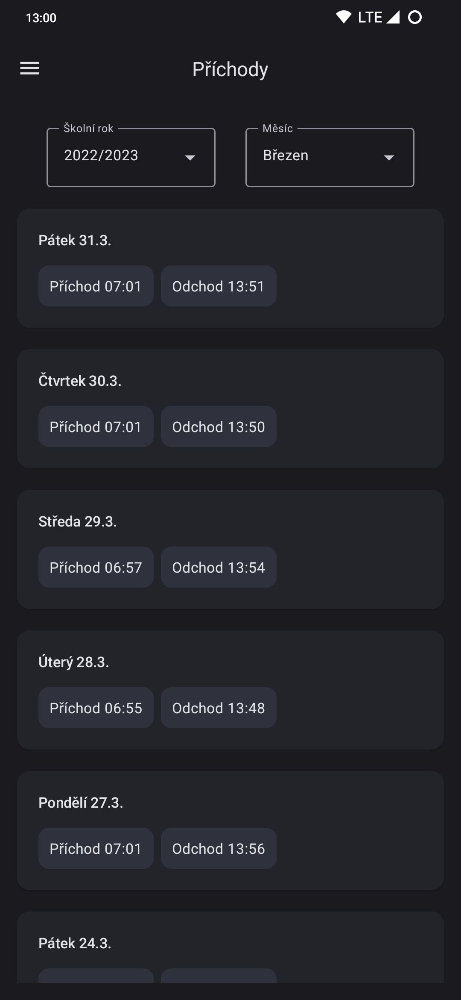
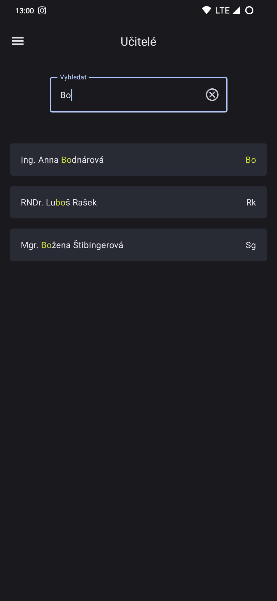

# Ječná Mobile

Ječná Mobile je android aplikace, vytvořená pro studenty [SPŠE Ječná v Praze](https://www.spsejecna.cz/). Byla vytvořena
z důvodů pohodlnosti čtení školního portálu. Aplikace je **NEOFICIÁLNÍ** a tím pádem **nemá nic společného se školním
softwarem**.

Můžete se podílet na vývoji: [Kontribuce](#Kontribuce)

## Instalace

Aplikaci si nainstalujte z [Google Play](https://play.google.com/store/apps/details?id=me.tomasan7.jecnamobile).  
Minimální podporovaný android je `Android 8.0 (Oreo)`.

## Funkce

- [x] Známky a průměr z každého předmětu
- [x] Rozvrh hodin
- [x] Obědnávání obědů ze školní jídelny
- [x] Příchody a odchody
- [x] Novinky
- [x] Učitelský sbor
- [ ] Předvídač známek
- [ ] Oznámení
- [ ] Burza v jídelně

## Screenshoty

  
  
  

  
  

## Kontribuce

Za váš příspěvek bude rád každý Ječňák s Androidem, takže neváhej přispět.

Předem upozorňuji, že kód aplikace je velmi nekvalitní a neměli byste se ním inspirovat. Je to z důvodu relativně velké složitosti vývoje pro Android a času.

### Info
- Ječná Mobile je zeložena na knihovně [JecnaAPI](https://github.com/Tomasan7/JecnaAPI), takže pokud budete chtít přidat nějakou novou funkci, týkající se stránek, budete muset upravit i JecnaAPI.
- Celá aplikace kód je v [Kotlinu](https://kotlinlang.org/docs/getting-started.html).

### Instalace

1. Nainstalujte si [Android Studio](https://developer.android.com/studio).
2. Forkněte si tento projekt.
2. Naklonujte svůj fork, buď přes terminál, nebo `Android Studio > New project from VCS`.
3. Počkejte než se vám vše načte.
4. Teď už to buď znáte, nebo musíte následovat tutoriály :)
5. Doporučuji pro testování používat fyzické zařízení a ne Emulátor, je to mnohem rychlejší, dá se to připojit i přes wifi, takže nemusíte to stále mít připojené kabelem.

### Pravidla

- Commity pište v angličtině a v imperative formě. Smysluplný popis. Podívejte se na ostatní commity.
- Bylo by fajn používat konzistentní formátování jako ve zbytku projektu, ale není to nutnost.
- Vždy aplikaci před začnutím pull requestu otestujte.
- Pokud chcete dělat větší změny, zkuste to se mnou nejdříve zkonzultovat.

I přesto, že můj kód je hnus, váš být nemusí :)
Klidně můžete i pročistit/vylepšit stávající kód.

Jakmile přidáte svůj kód, udělejte pull-request a napište smysluplný popis.
